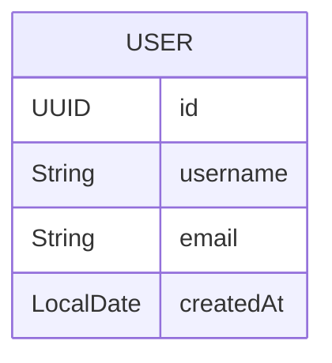
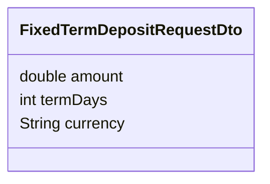
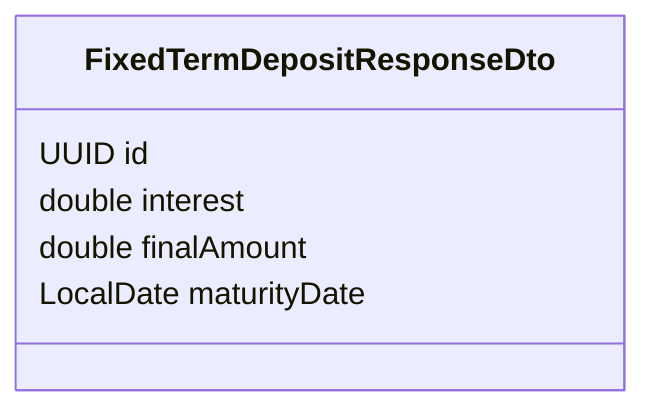

# Mermaid Sequence Diagram Generator (Spring Boot Adapted)

## Overview

This tool generates **sequence diagrams**, **entity diagrams**, and **DTO diagrams** for Spring Boot backend systems.
It focuses on representing **complete execution flows**, including all layers and mappings involved in a specific use case, controller, or service.

---

## 1. Scope

Only **sequence diagrams** will be generated for execution flows, while **entity** and **DTO** diagrams will represent each class individually.
These diagrams visualize the full execution flow through the backend architecture, highlighting all class interactions and parameters.

---

## 2. Diagram Generation Rules

When invoked with `/mermaid`, the generator will:

1. Create the `docs/diagrams/` directory if it doesn’t exist.
2. Generate:
   - `docs/diagrams/<feature>-sequence.md`: full sequence diagram of the flow.
   - `docs/diagrams/<feature>-entities/`: directory containing one `.md` file **per entity class** involved in the flow.
   - `docs/diagrams/<feature>-dtos/`: directory containing one `.md` file **per DTO class** involved in the flow.

3. Update `docs/diagrams/README.md` to include links to the generated diagrams and their purposes.

---

## 3. Sequence Diagram Rules

### Participants

| Type                        | Description                            | Representation             |
| --------------------------- | -------------------------------------- | -------------------------- |
| **Actor**                   | External user or system                | `actor` type in Mermaid    |
| **Controller (Boundary)**   | Entry point of a request               | Blue-colored participant   |
| **Service (Control)**       | Business logic handlers                | Green-colored participant  |
| **Repository**              | Persistence layer                      | Orange-colored participant |
| **Entity/DTO**              | Domain or data transfer objects        | Gray-colored participant   |
| **Mapper**                  | Object transformation layer            | Purple-colored participant |
| **Strategy Implementation** | Classes following the Strategy Pattern | Highlighted in Red         |

### Flow Rules

- The diagram must trace **every method call**, showing **all parameters explicitly** (no summarization).
- When a method invokes another class (Controller → Service → Repository → Mapper → etc.), the call must be shown in order.
- If a class corresponds to a **Strategy implementation**, it must be **highlighted in red**.
- The diagram must conclude with a terminal labeled **`finCU()`**, indicating the end of the use case.
- This terminal must always be placed over the **main Service** responsible for the business logic.

### Example (Conceptual)

```mermaid
%%{init: {'version': '11.12.1'}}%%
sequenceDiagram
    autonumber
    actor U as User
    participant C as FixedTermDepositController
    participant S as FixedTermDepositService
    participant M as FixedTermDepositMapper
    participant R as FixedTermDepositRepository
    participant E as FixedTermDepositEntity

    U->>C: POST /investment/fixed-term-deposit(dto)
    C->>S: registerFixedTermDeposit(dto, user)
    S->>M: toEntity(dto)
    M-->>S: FixedTermDepositEntity
    S->>R: save(entity)
    R-->>S: FixedTermDepositEntity
    S->>M: toResponseDto(entity)
    M-->>S: FixedTermDepositResponseDto
    S-->>C: FixedTermDepositResponseDto
    C-->>U: 201 Created (responseDto)
    note over U,C,S,M,R,E: finCU()
```

### Color Scheme (for diagram rendering tools that support it)

```mermaid
%%{init: {'version': '11.12.1'}}%%
%% Define colors by class type
classDef controller fill:#2196f3,stroke:#fff,color:#fff
classDef service fill:#4caf50,stroke:#fff,color:#fff
classDef repository fill:#ff9800,stroke:#fff,color:#fff
classDef entity fill:#9e9e9e,stroke:#fff,color:#fff
classDef mapper fill:#9c27b0,stroke:#fff,color:#fff
classDef strategy fill:#f44336,stroke:#fff,color:#fff

class C controller
class S service
class R repository
class E entity
class M mapper
```

---

## 4. Entity Diagram Rules

- Each **entity class** involved in the flow must have its own `.md` file located in `docs/diagrams/<feature>-entities/`.
- The diagram must display only the class and its **attributes**, without showing relationships or mappers.
- Each file should contain **one `erDiagram` block** representing a single entity.

### Example (`UserEntity.md`)



---

## 5. DTO Diagram Rules

- Each **DTO class** involved in the flow must have its own `.md` file located in `docs/diagrams/<feature>-dtos/`.
- The diagram must display only the DTO class and its **attributes**, without showing relationships, mappers, or dependencies.

### Example (`FixedTermDepositRequestDto.md`)



### Example (`FixedTermDepositResponseDto.md`)



---

## 6. Maintenance Rules

- Diagrams must be **updated** with every change in controller or service logic.
- Use **consistent class naming** and **color coding**.
- All Mermaid syntax must be **validated** using an online Mermaid editor before committing.
- Reference all generated diagrams from `IMPLEMENT.md`.

---

## 7. Output Summary

| File/Directory                        | Purpose                                      |
| ------------------------------------- | -------------------------------------------- |
| `docs/diagrams/<feature>-sequence.md` | Full backend call flow                       |
| `docs/diagrams/<feature>-entities/`   | Folder containing one `.md` per entity class |
| `docs/diagrams/<feature>-dtos/`       | Folder containing one `.md` per DTO class    |
| `docs/diagrams/README.md`             | Index and explanation of diagrams            |
